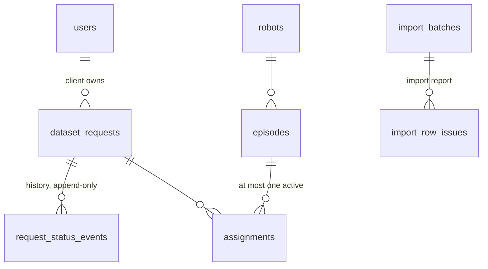

# Notes

Details are in [`docs/`](docs/); every decision is logged in [`PLAN.md` §14](PLAN.md#14-decision-log-for-notesmd).

## 1. Design

**Where state lives.** All durable state is in **PostgreSQL**: domain data, import reports, the shared cache,
login-throttle counters, idempotency keys and the email outbox. API processes are stateless, so they scale out. A
request's current `status` is a column, for fast filters. Its history is an append-only events table (who, when,
from → to, comment), written in the same transaction by one table-driven state machine
(`requests_desk/workflow.py`). The state machine checks the step, the role and the "enough episodes" rule.

**Hardest decisions**

1. **What "idempotent" means for a messy import.** The recording system is the source of truth: an upsert on
   `episode_id`, so each row is *created, updated, unchanged* or *skipped*. Re-running a file gives `0 created`.
   One exception: an update that would make an **assigned** episode `bad` is skipped, so the import can't break the
   assignment rule behind the operators' backs. Every messy case has an explicit outcome ("fixed" or "skipped" with
   a reason). The seed file gives 173 created, 17 skipped, 9 fixed; the cases are listed in
   [`PLAN.md` §8](PLAN.md#8-csv-import-decisions-per-messy-case).
2. **"One active request per episode" is enforced by the database.** A check in Python lets two simultaneous
   assignments both succeed. A partial unique index (`UNIQUE(episode_id) WHERE released_at IS NULL`) refuses the
   second whatever the timing. Bulk assign is all-or-nothing and lists every problem at once.
3. **Sessions that can be revoked.** Refresh tokens rotate, and reusing an old one (a stolen copy) ends all of
   that user's sessions. A `session_version` in every token makes deactivation, a role change or a password change
   end every session at once, including access tokens already issued.

**Where the brief was open, I decided:**
- Another client's request is a **404**, not 403, so it isn't confirmed to exist.
- Episodes must match the request's **task**.
- The median uses the **first** delivery, so rework doesn't hide a slow start.
- Naive CSV times are **UTC**, and `DD/MM/YYYY` is day-first.
- Deadlines follow the **Kigali** business day.
- A delivery nobody reviews triggers reminders, then escalates to an operator. It is never auto-accepted.

## 2. Left out or simplified

- **Excel import (#36) and the migration of existing spreadsheet requests (#37).** Both would be a reader in
  front of the same row rules, but neither is built.
- **The import runs inside the HTTP request.** That's fine at 200k rows (49 s), not for millions.
- **No self-service password reset and no 2FA**; admins set passwords.
- **Operations:** there is Sentry and `/health`, but no log shipping or uptime alert. Nightly ZAP and Playwright
  runs (#46, #47) are not built.

**With two more days:** the import as a background job with progress; the Excel and migration imports with a
dry-run preview; Playwright journeys per role; log shipping and alerts.

## 3. Something that went wrong

A k6 load test (10,000 requests from 200 users, with 100k requests in the database) completed only **8,702 in 10
minutes**, with 2.3 % errors and a p95 of about 18 s. I assumed analytics was the culprit and cached it, with
stampede protection. Analytics dropped to about 0.3 s at the median, but the request list still averaged 15 s,
and `docker stats` showed **PostgreSQL at about 800 % CPU**. `EXPLAIN ANALYZE` showed why: the "active
assignments" count was a `JOIN … GROUP BY` over **every** request, about 3 s per page, before the 25 rows were
picked. A correlated subquery counts only the rows on the page. After the change: **10,000/10,000 in 92 s, 0
errors, 7.5× the throughput, p95 3.6 s**, and what remains is threads waiting in line, not the database. A test
now fails if that `GROUP BY` comes back. **Lesson:** I optimised the endpoint I *expected* to be slow, and the
measurement pointed elsewhere ([`docs/performance.md`](docs/performance.md)).

A smaller one, caught by a test: on detecting a stolen refresh token, the code revoked the user's sessions inside
a transaction that then raised an error, so the revocation was rolled back. It now commits first.

## 4. Security

- **Passwords:** Argon2id; at least 12 characters, not common, not like the email. The seed passwords are hashed.
- **Tokens:**
  - The access token lasts 10 minutes and is held in memory only.
  - The refresh token is in an `HttpOnly; Secure; SameSite=Strict` cookie, scoped to `/api/auth/`. It rotates
    and is blacklisted after use, and reusing an old one revokes every session.
  - Login is throttled per IP and per email, and security events are audit-logged.
- **Input validation:**
  - Every input goes through a serializer. Unknown, blank or repeated query parameters are a 400, not ignored.
  - Uploads must be CSV, UTF-8, at most 20 MB.
  - There is one error shape, and a 500 reveals nothing.
  - **Schemathesis** fuzzes about 2,600 requests on every PR. Its first run found 23 problems, all fixed
    ([`docs/testing.md`](docs/testing.md#fuzzing)).
- **Also:** CSP `default-src 'none'`, HSTS, cross-site requests refused on the cookie endpoints, idempotency keys
  on writes, and CodeQL, Bandit and dependency audits in CI.

**The two I'd worry about most:**

1. **Broken object-level authorisation**: one client reading another's request by id. It is the most common API
   flaw, and here it leaks customer data. Mitigations: UUIDs; querysets scoped to the user *before* lookup (other
   clients' requests are a 404); role checks in one place; per-role tests on every endpoint.
2. **Session theft through XSS.** That's why the refresh token is out of JavaScript's reach and the access token
   is short-lived and in memory. What remains is an attacker acting *during* an XSS, so the UI must never render
   unescaped HTML, with the CSP as the backstop.

## 5. Scale

**10× users: API capacity breaks first.** One instance has 24 threads; at 200 concurrent users, most of the p95 was
waiting for a free thread. Changes:
- More instances (they're stateless).
- **PgBouncer**, since each thread holds a database connection.
- **Redis** for the rate limits and the cache, once the cache table gets hot.

**100× episodes (about 20M): the import breaks first.** It parses inside the request and upserts in one
transaction: 49 s for 200k rows, hours and a huge lock at 20M. Change: a background job with `COPY` into a
staging table, then set-based upserts committed in chunks, with progress reporting.

**Then analytics.** It stays correct but gets slow on a cache miss. Change: a daily roll-up table updated by the
import, and episodes partitioned by `recorded_at`. The operators' filters are already indexed, with query-budget
tests guarding them.

## 6. AI tooling

I used **Claude Code** (Anthropic's terminal coding assistant) as a pair programmer for:
- breaking the brief into a plan, a data model and user stories;
- drafting tests first, then the code;
- reviewing and auditing, which found the time-zone bug and gaps in the API docs;
- running and reading the load tests and the fuzzing.

The choices of stack, workflow and trade-offs are mine. Every change went through a pull request with CI, after
I'd read it, run it and questioned it, and I can explain and modify any line.
