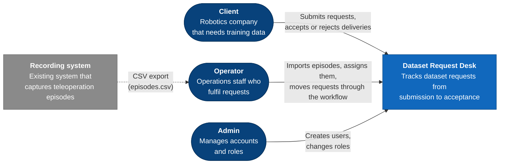
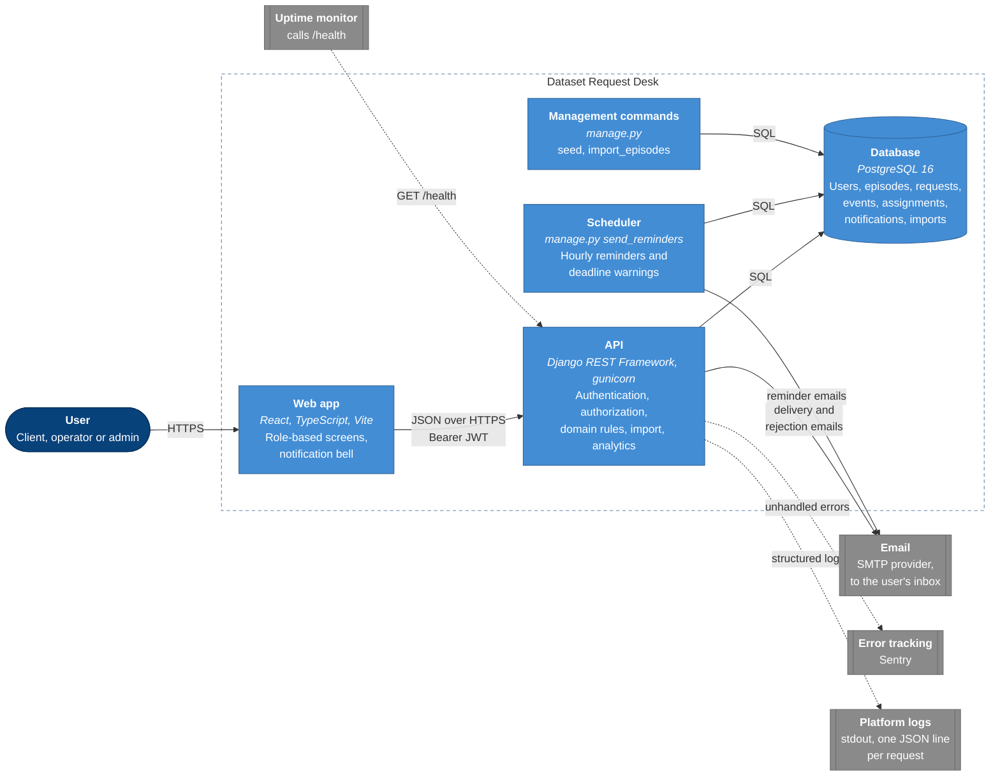
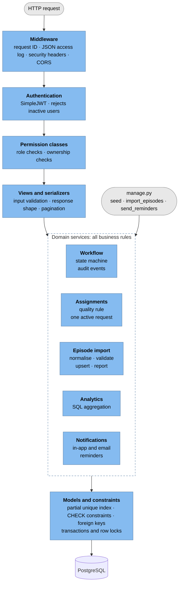
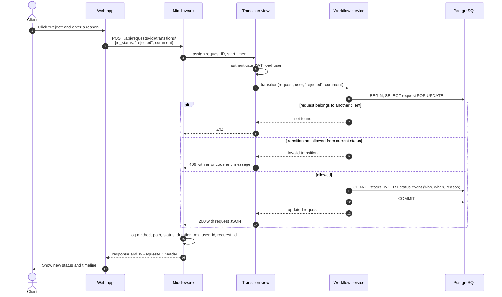
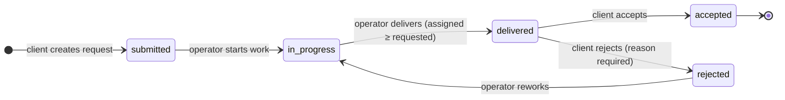
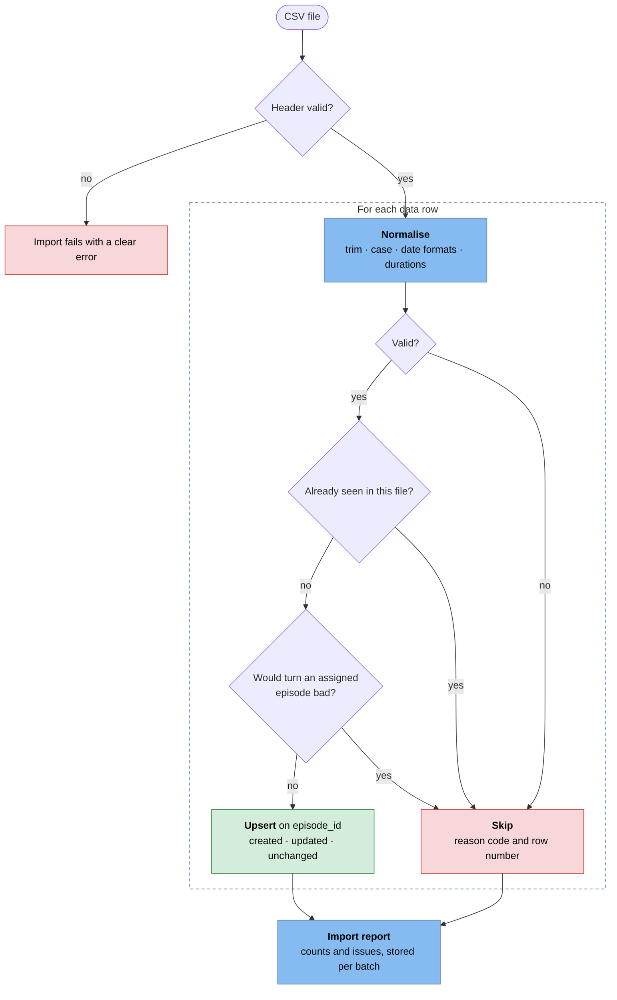
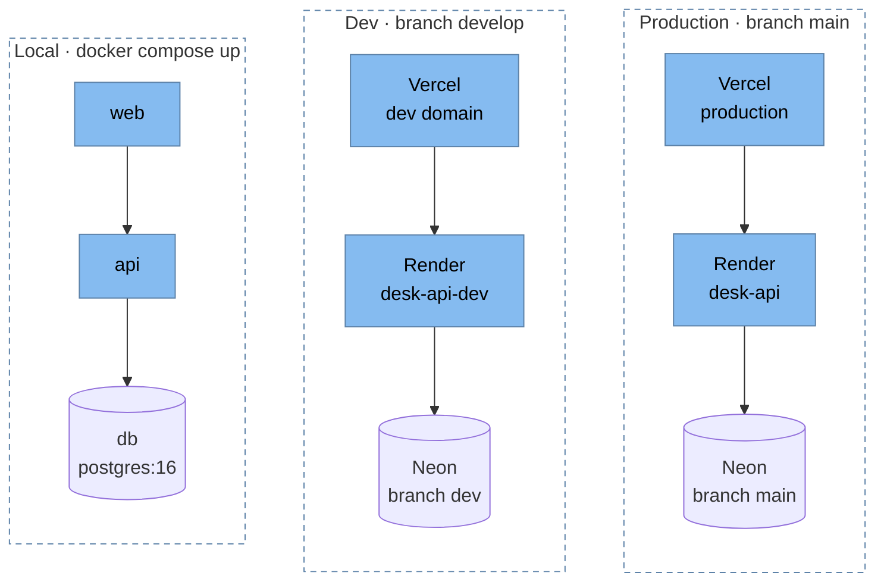

# Architecture

This document describes the Dataset Request Desk from the outside in, following the
[C4 model](https://c4model.com): system context, containers, then components, followed by the
behaviour that matters most (request lifecycle, status workflow, CSV import) and how the system is
built and deployed.

Diagrams are written in [Mermaid](https://mermaid.js.org) so they are versioned and reviewed with
the code. The data model is in [erd.dbml](erd.dbml) (render at [dbdiagram.io](https://dbdiagram.io)).
The reasoning behind each choice is in the decision log in [PLAN.md](../PLAN.md#14-decision-log-for-notesmd).

## 1. System context

Who uses the system and what it depends on.

The recording system is **not integrated directly**: operators upload its CSV export. This keeps
the first version decoupled from a system we don't control, and the import is built to be re-run
safely on the same file.

## 2. Containers

The separately running parts and how they communicate.

| Container | Responsibility | Holds state? |
|---|---|---|
| Web app | Screens per role; talks only to the API | No: only UI state and the session tokens |
| API | Every rule is enforced here: authentication, role and ownership checks, workflow, assignment rules | No: stateless, so it scales horizontally |
| Scheduler | Runs the idempotent `send_reminders` command every hour: delivery reminders, escalations, deadline warnings, email retries | No |
| Management commands | Seeding and CLI import; reuse the same domain services as the API | No |
| Database | Single source of truth; constraints back up the rules in code | **Yes** |

## 3. Backend components

How the API is layered. Business rules live in **services**, not in views, so the HTTP API and the
management commands share exactly the same logic. The database is the last line of defence.

Two parts sit beside this chain: an **error handler** turns failures from any layer into one JSON error
shape, and **`/health`** answers without authentication so load balancers and uptime checks can call it.

| Django app | Owns |
|---|---|
| `core` | Settings helpers, health check, logging middleware, error handling, shared permissions |
| `accounts` | Custom user (email login, role), authentication, user management, seed command |
| `catalog` | Robots, episodes, CSV import service, `import_episodes` command, import reports |
| `requests_desk` | Dataset requests, status workflow and events, assignments |
| `notifications` | Notification records, inbox endpoints, email delivery, `send_reminders` command |
| `analytics` | Read-only analytics endpoint backed by SQL aggregation |

## 4. Request lifecycle

One authenticated call end to end, using a client rejecting a delivery as the example.

The row lock (`SELECT … FOR UPDATE`) makes concurrent actions on the same request safe: two
operators clicking "Deliver" at the same moment are serialised, and the second one sees the new
status.

## 5. Request status workflow

The only allowed transitions. Anything else returns **409 Conflict**; the right transition by the
wrong role returns **403 Forbidden**. Every change writes an audit event.

| Transition | Allowed roles | Guard |
|---|---|---|
| `submitted → in_progress` | operator, admin | – |
| `in_progress → delivered` | operator, admin | active assignments ≥ `episodes_requested` |
| `delivered → accepted` | owning client | – |
| `delivered → rejected` | owning client | reason required |
| `rejected → in_progress` | operator, admin | – |

Episodes can only be assigned or unassigned while a request is `in_progress`.

## 6. CSV import pipeline

The export is messy, so every row is normalised, validated and either upserted or reported. The
same file can be imported any number of times without creating duplicates.

Values that can be safely fixed (casing, whitespace, alternative date formats) are imported and
noted in the report as *fixed*. Each case and its decision is listed in PLAN.md §8.

## 7. How problems reach people

Nobody watches logs all day, so the system pushes problems to the people who can act on them. Logs are kept for
*explaining* a problem once someone knows about it.

| Situation | Who finds out | How |
|---|---|---|
| A delivery waits for the client's decision | Client, then the delivering operator | Reminder email and in-app notification every 3 days (at most 3), then an escalation to the operator |
| A deadline is 2 days away and nothing is delivered | Operators | In-app deadline warning, once per request |
| The API throws an unhandled error | Development team | Sentry email with stack trace, request and user id |
| The API or database is down | Development team | Uptime monitor calls `/health` and alerts on failure |
| Investigating any of the above | Development team | JSON logs, found by the `X-Request-ID` shown to the user |

## 8. Deployment

Three environments with the same container image and configuration from environment variables.

| Concern | Approach |
|---|---|
| HTTPS | Terminated by Vercel and Render |
| Secrets | Host environment settings and GitHub Actions secrets; never in the repository |
| Migrations | Applied by the container entrypoint on start |
| Configuration | Environment variables only (see `.env.example`); missing required values stop startup |

## 9. Delivery pipeline

How a change reaches production. Nothing merges without passing checks, and nothing reaches
production without a release PR and manual approval.

```mermaid
flowchart LR
    branch["Work branch<br/>feat/ fix/ chore/ …"] --> pr["Pull request<br/>into develop"]

    subgraph checks["Required checks"]
        direction TB
        naming["Branch naming"]
        commits["Conventional commits"]
        ci["CI: hygiene · backend tests<br/>frontend build · compose smoke test"]
    end

    pr --> checks --> develop["Merge into develop"]
    develop --> devdeploy["Deploy to dev"]
    develop --> release["Release PR<br/>develop → main"]
    release --> approve(["Manual approval<br/>production environment"])
    approve --> proddeploy["Deploy to production"]

    classDef step fill:#85bbf0,stroke:#5d82a8,color:#000
    classDef check fill:#e8e8e8,stroke:#999,color:#000
    classDef deploy fill:#d4edda,stroke:#2e7d32,color:#000
    classDef gate fill:#fff3cd,stroke:#b58900,color:#000
    class branch,pr,develop,release step
    class naming,commits,ci check
    class devdeploy,proddeploy deploy
    class approve gate
    style checks fill:transparent,stroke:#5d82a8,stroke-width:1px,stroke-dasharray:5 4
```

